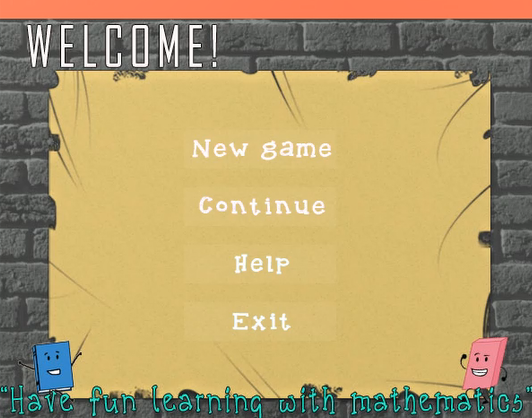
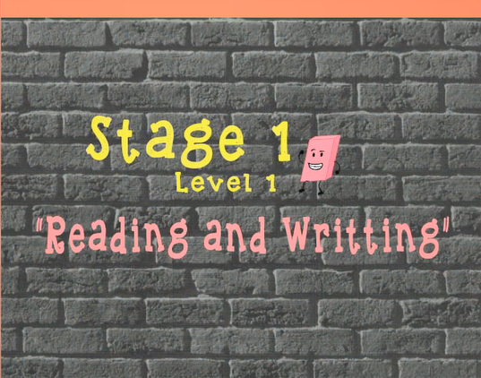
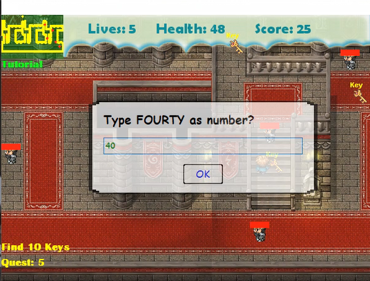
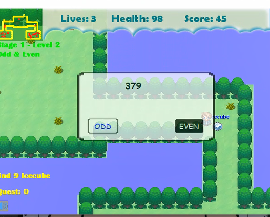
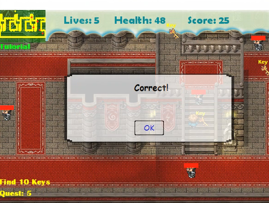
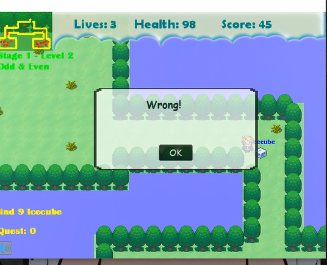
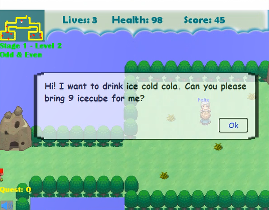
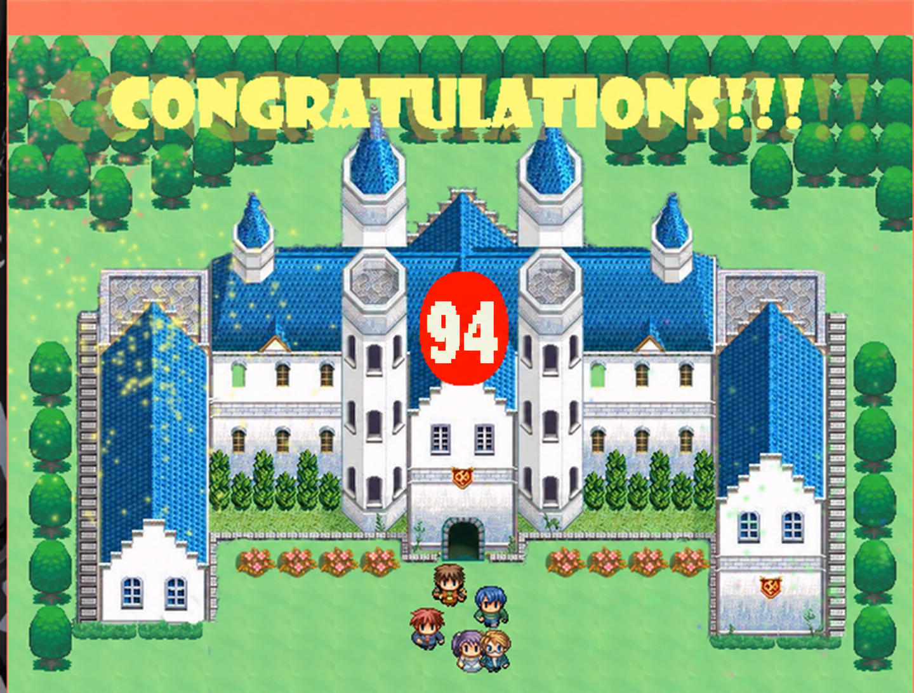

# Hi there, I'm Mdee 👋🏼

### AI Automation | 3D Technical Animation | Content Creator

---

## 🤖 AI & Automation

- **n8n** Workflow Automation
- **JavaScript**
- AI / LLM Integration
- OCR & Document Processing
- Google Workspace • Google Cloud
- Google Sheets • Google Drive • Gmail
- WhatsApp • Xero
- Meta Ads Lead Automation

## 🎮 3D & Game Development

- Unity
- Blender
- Unreal Engine
- GameMaker Studio
- Character Rigging
- Animation Retargeting
- Animation Systems
- State Machines
- Blend Trees
- FBX / OBJ Conversion

## 🎥 Content & AI Video

- YouTube — **200K+ Subscribers**
- 3D Animation Storytelling
- CapCut • KineMaster
- PixVerse • Kling

## 🛠️ Tools

  
  

  
  
  
  
  
  
  

---

# 🚀 Featured Projects

## 📒 AI Bookkeeping Automation

**n8n + AI + OCR + Google Sheets + Xero**

Automated receipt processing, data extraction, duplicate detection, file organization, and bookkeeping workflows.

  

---

## 🎯 Meta Ads Lead Automation

**Meta Ads + n8n + AI**

Automated lead capture and processing for Meta advertising campaigns.

  

---

## 🎮 Unity Technical Animation

**Unity + Blender + Unreal Engine**

Character rigging, animation retargeting, animation systems, State Machines, Blend Trees, and FBX/OBJ workflows.

  

---

## 🎥 AI Video Content Creation

**PixVerse + Kling + 3D Animation**

AI-assisted video production and visual storytelling.

  

---

## 🕹️ Educational Mathematics RPG

**GameMaker Studio**

Educational RPG game developed for elementary students, combining gameplay with mathematics problem solving.

  
  
  
  

  
  
  

  
  

